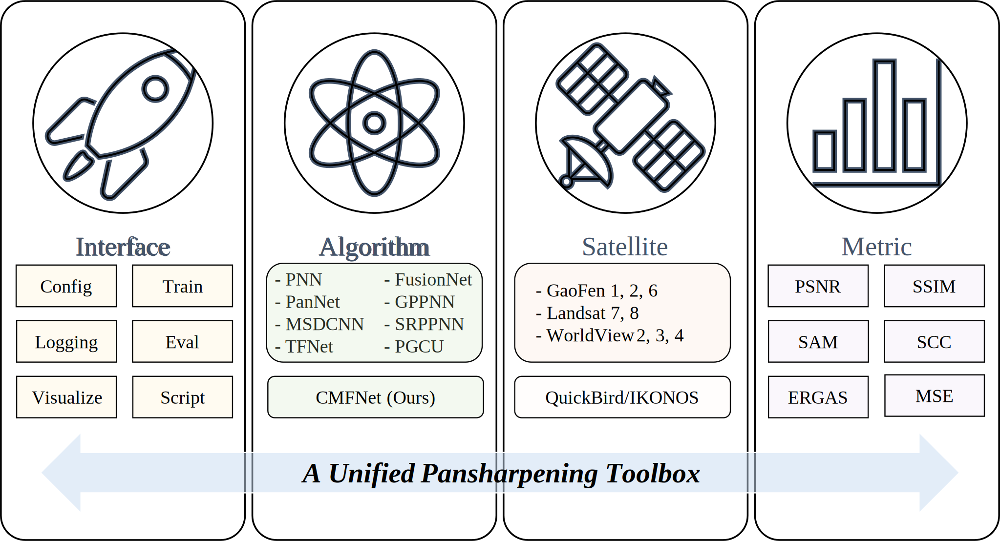
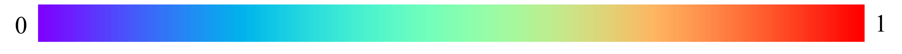

# PanBench: Towards High-Resolution and High-Performance Pansharpening

<p align="left">
<a href="https://arxiv.org/abs/2311.12083" alt="arXiv">
    </a>
<a href="https://github.com/XavierJiezou/Pansharpening/blob/main/LICENSE" alt="license">
    </a>
<!-- <a href="https://huggingface.co/OpenSTL" alt="Huggingface">
    </a> -->
<!-- <a href="https://openstl.readthedocs.io/en/latest/" alt="docs">
    </a> -->
<!-- <a href="https://github.com/chengtan9907/OpenSTL/issues" alt="docs">
    </a> -->
<a href="https://github.com/XavierJiezou/Pansharpening/issues" alt="resolution">
    </a>
<a href="https://img.shields.io/github/stars/XavierJiezou/Pansharpening" alt="stars">
    </a>
</p>

## Introduction

This repository is the official PyTorch implementation of our paper *PanBench: Towards High-Resolution and High-Performance Pansharpening*.

<p align="center" width="100%">
  
</p>

<p align="right">(<a href="#top">back to top</a>)</p>

## Requirements

To install dependencies:

```bash
pip install -r requirements.txt
```

## Dataset

```bash
PanBench
├─GF1
│  ├─NIR_256
│  ├─PAN_1024
│  └─RGB_256
├─GF2
│  ├─NIR_256
│  ├─PAN_1024
│  └─RGB_256
├─GF6
│  ├─NIR_256
│  ├─PAN_1024
│  └─RGB_256
├─IN
│  ├─NIR_256
│  ├─PAN_1024
│  └─RGB_256
├─LC7
│  ├─NIR_256
│  ├─PAN_1024
│  └─RGB_256
├─LC8
│  ├─NIR_256
│  ├─PAN_1024
│  └─RGB_256
├─QB
│  ├─NIR_256
│  ├─PAN_1024
│  └─RGB_256
├─WV2
│  ├─NIR_256
│  ├─PAN_1024
│  └─RGB_256
├─WV3
│  ├─NIR_256
│  ├─PAN_1024
│  └─RGB_256
└─WV4
    ├─NIR_256
    ├─PAN_1024
    └─RGB_256
```

## Training

To train the models in the paper, run these commands:

```bash
python src/train.py experiment=cmfnet
```

## Testing

To test the models in the paper, run these commands:

```bash
python src/train.py experiment=cmfnet
```

## Evaluation

To evaluate the models in the paper, run these commands:

```bash
python src/eval.py experiment=cmfnet
```

## Pre-trained Models

You can download pretrained models here: CMFNet.

## Overview of Model Zoo and Datasets

We support various pansharpening methods and satellites. We are working on add new methods and collecting experiment results.

- Currently supported methods.

  - [x] [PNN](https://www.mdpi.com/2072-4292/8/7/594) (Remote Sensing'2016)
  - [x] [PanNet](https://xueyangfu.github.io/paper/2017/iccv/YangFuetal2017.pdf) (ICCV'2017)
  - [x] [MSDCNN](https://arxiv.org/abs/1712.09809) (J-STARS'2018)
  - [x] [TFNet](https://arxiv.org/abs/1711.02549) (Inform. Fusion'2020)
  - [x] [FusionNet](https://ieeexplore.ieee.org/abstract/document/9240949) (TGRS'2020)
  - [x] [GPPNN](https://arxiv.org/abs/2103.04584) (CVPR'2021)
  - [x] [SRPPNN](https://ieeexplore.ieee.org/abstract/document/9172104) (TGRS'2021)
  - [x] [PGCU](https://arxiv.org/abs/2303.13659) (CVPR'2023)

- Currently supported satellites.

  - [x] GaoFen1
  - [x] GaoFen2
  - [x] GaoFen6
  - [x] Landsat7
  - [x] Landsat8
  - [x] WorldView2
  - [x] WorldView3
  - [x] WorldView4
  - [x] QuickBird
  - [x] IKONOS

## Visualization

We provide a visualization tool to help you understand the training process. You can use the following command to start the visualization tool.

```shell
python visualize.py
```




## License

This project is released under the [Apache 2.0 license](LICENSE). See `LICENSE` for more information.
